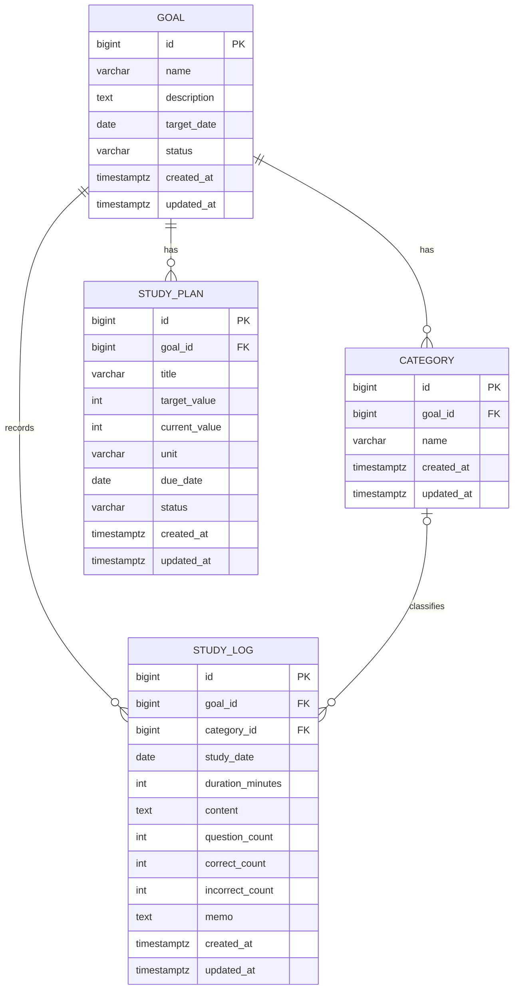

# StudyPilot Ver.1 ER diagram

```mermaid
erDiagram
    GOAL ||--o{ CATEGORY : has
    GOAL ||--o{ STUDY_PLAN : has
    GOAL ||--o{ STUDY_LOG : records
    CATEGORY o|--o{ STUDY_LOG : classifies

    GOAL {
        bigint id PK
        varchar name
        text description
        date target_date
        varchar status
        timestamptz created_at
        timestamptz updated_at
    }

    CATEGORY {
        bigint id PK
        bigint goal_id FK
        varchar name
        timestamptz created_at
        timestamptz updated_at
    }

    STUDY_PLAN {
        bigint id PK
        bigint goal_id FK
        varchar title
        int target_value
        int current_value
        varchar unit
        date due_date
        varchar status
        timestamptz created_at
        timestamptz updated_at
    }

    STUDY_LOG {
        bigint id PK
        bigint goal_id FK
        bigint category_id FK
        date study_date
        int duration_minutes
        text content
        int question_count
        int correct_count
        int incorrect_count
        text memo
        timestamptz created_at
        timestamptz updated_at
    }
```

`STUDY_LOG.category_id` is nullable, so uncategorized study records are allowed.

